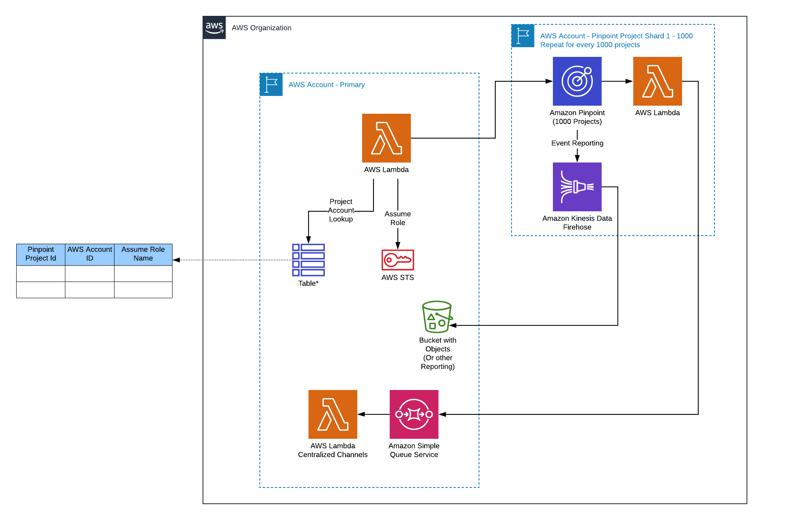

# Amazon Pinpoint Cross Org Project Setup

## Architecture Diagram

*DynamoDB and Lambda with STS logic not included

## Files
* [PrimaryAccount.yaml](PrimaryAccount.yaml) - Used to set up assets in the Primary Account
* [SubAccount.yaml](SubAccount.yaml) - Used to set up assets in each Sub Account
* [PinpointProject.yaml](PinpointProject.yaml) - Used to set up each Pinpoint Project in sub accounts
